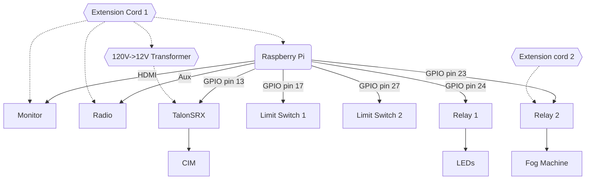

# floats-2022
All the code for the 2022 Senior float. 

This year's electrical components include the opening and closing hatch, the fog machine, the radio, the monitor, and the 
LED lights. Mechanically, these systems are connected like so:


Last year's floats code can be found [here](https://github.com/ky28059/hoco-radio-2021).

### Overall structure
This year's code utilizes `multiprocessing` to run several submodules in parallel. Individual modules are located in `/modules`,
and (with the exception of `schedule.py`) are designed to be able to run by themselves. To run a single module, run its
corresponding script in `/modules`. To run all modules simultaneously with multiprocessing, run `main.py`.

All scripts were designed to run on a Raspberry Pi with the newest OS image and Python 3.9.2.

### Schedule
The schedule module parses and updates internal schedule data states, using multiprocessing `Event`s to alert other
processes to state changes.

`schedule.json` is a modified WATT schedule JSON with 0th and 8th periods removed to keep the school start and end times 
at their expected values; because of WATT's updated array-based syntax, these schedules are easier to parse than those 
used on the 2021 float. The script no longer checks the `MM-DD` formatted date, instead using the current weekday to load 
the schedule.

### Radio
```bash
python3 ./modules/radio.py
```
The radio module maintains a similar architecture to last year's `radio2.py`, reading `.wav` files from `./music` and 
playing them in a tick-based loop. The script begins playing music 45 minutes before school, sets volume to 10% during 
class time, and stops playing music 15 minutes after school.

This year's music playlist can be found here: https://www.youtube.com/playlist?list=PL7WwPfnTGk9HsZMm-G_JlF1buJ8Nit32S

### Hatch
```bash
python3 ./modules/hatch.py
```
The hatch module runs the hatch mechanism on the float. It turns on the LEDs and fog machine and runs the motor forward,
waiting 3 seconds before turning the LEDs and fog machine off and closing the hatch again. The module reads limit switch
input to determine the position of the hatch, timing out after 5 seconds in case of limit switch failure. The hatch only
runs during passing period, 45 minutes before school, and 15 minutes after school.

`hatch.py` uses `RPi.GPIO` software PWM, and as such is inconsistent at controlling the motor (especially when CPU is 
being taken by other tasks, such as the radio or video). To run the hatch with hardware PWM, see the next section.

### Hatch (with hardware PWM)
```bash
python3 ./modules/hatch2.py
```
`hatch2.py` runs the same logic as `hatch.py`, but uses `pigpio` hardware PWM instead of `RPi.GPIO`. `hatch2` requires
the `pigpio` daemon running with
```bash
sudo pigpiod
```
or `sudo pigpiod -g` in a different terminal window if it needs to be terminated easily. Because `pigpio` uses the hardware
PWM peripheral to generate PWM signal, it cannot be run with `radio.py` while audio output is set to the AV jack because 
the Pi [uses the PWM peripheral to play audio over aux](https://raspberrypi.stackexchange.com/a/46538) (see also:
[similar stackexchange question](https://raspberrypi.stackexchange.com/questions/88160/using-hardware-pwm-and-audio-simultaneously),
[`pigpio` docs](http://abyz.me.uk/rpi/pigpio/faq.html#Sound_isnt_working)). Instead, connect to the speaker over bluetooth;
audio will work then.

To run the radio and hardware PWM hatch simultaneously, run
```bash
python3 main2.py
```
instead.

### Tests
`/tests` contains test scripts to unit-test specific components of the float. The following is a list of tests and what
they test for:

| Test                                  | Description                                                                                                                                                                                        |
|---------------------------------------|----------------------------------------------------------------------------------------------------------------------------------------------------------------------------------------------------|
| `relay_test.py`                       | Tests controlling relays with the Raspberry Pi. This test activates both relays for 5 seconds, then turns them off again. <!-- wording -->                                                         |
| `motor_test.py`                       | Tests running a TalonSRX with PWM signal from the Raspberry Pi's GPIO pins. This test sweeps the motor from `0` to full forward power, then to full reverse power, then back to `0`.               |
| `limit_switch_test.py`                | Tests reading limit switch input with the Raspberry Pi. This test starts a loop that logs to the console every rising edge it detects over the two configured limit switch pins in `constants.py`. |
| `limit_switch_motor_test.py`          | Tests controlling a TalonSRX with limit switch input. This test runs the talon at `0.5` power, toggling it between forward and reverse on limit switch hits.                                       |
| `hardware_relay_test.py`              | `relay_test.py`, but using `pigpio` instead of `RPi.GPIO`.                                                                                                                                         |
| `hardware_motor_test.py`              | `motor_test.py`, but using `pigpio` instead of `RPi.GPIO` (hardware instead of software PWM).                                                                                                      |
| `hardware_limit_switch_test.py`       | `limit_switch_test.py`, but using `pigpio` instead of `RPi.GPIO`.                                                                                                                                  |
 | `hardware_limit_switch_motor_test.py` | `limit_switch_motor_test.py`, but using `pigpio` instead of `RPi.GPIO`.                                                                                                                            |

All hardware tests require running the `pigpio` daemon.
