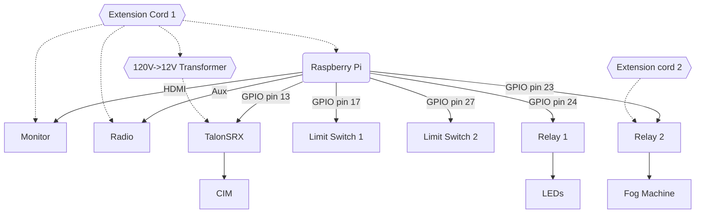

# floats-2022
All the code for the 2022 Senior float. 

This year's electrical components include the opening and closing hatch, the fog machine, the radio, the monitor, and the 
LED lights. Mechanically, these systems are connected like so:

### Overall structure
This year's float code utilizes `multiprocessing` to run several submodules in parallel. Individual modules are located in `/modules`,
and (with the exception of `schedule.py`) are designed to be able to run by themselves. To run a single module, run its
corresponding script in `/modules`. To run all modules simultaneously with multiprocessing, run `main.py`.

### Schedule
The schedule module parses and updates internal schedule data states, using multiprocessing `Event`s to alert other
processes to state changes.

`schedule.json` is a modified WATT schedule JSON with 0th and 8th periods removed to keep the school start and end times 
at their expected values; because of WATT's updated array-based syntax, these schedules are easier to parse than those 
used on the 2021 float. The script no longer checks the `MM-DD` formatted date, instead using the current weekday to load 
the schedule.

### Radio
The radio module maintains a similar architecture to last year's `radio2.py` script ([`hoco-radio-2021`](https://github.com/ky28059/hoco-radio-2021)),
reading music files from `./music` and playing them in a tick-based loop. The script begins playing music 45 minutes 
before school, sets volume to 10% during class time, and stops playing music 15 minutes after school.

This year's music playlist can be found here: https://www.youtube.com/playlist?list=PL7WwPfnTGk9HsZMm-G_JlF1buJ8Nit32S

<!-- ### Hatch -->

### Tests
`/tests` contains test scripts to unit-test specific components of the float. The following is a list of tests and what
they test for:

| Test                         | Description                                                                                                                                                                                        |
|------------------------------|----------------------------------------------------------------------------------------------------------------------------------------------------------------------------------------------------|
| `relay_test.py`              | Tests controlling relays with the Raspberry Pi. This test activates both relays for 5 seconds, then turns them off again. <!-- wording -->                                                         |
| `motor_test.py`              | Tests running a TalonSRX with PWM signal from the Raspberry Pi's GPIO pins. This test sweeps the motor from `0.5` power forwards to `0.5` power backwards.                                         |
| `limit_switch_test.py`       | Tests reading limit switch input with the Raspberry Pi. This test starts a loop that logs to the console every rising edge it detects over the two configured limit switch pins in `constants.py`. |
| `limit_switch_motor_test.py` | Tests controlling a Talon with limit switch input. This test logs every rising edge it detects on the two limit switch pins, toggling the motor forwards and backwards on limit switch hits.       |
