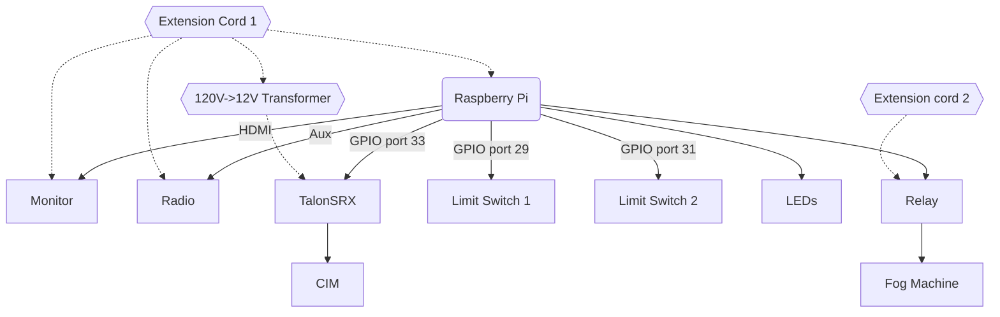

# floats-2022
All the code for the 2022 Junior float. 

This year's electrical components include the opening and closing hatch, the fog machine, the radio, the monitor, and the 
LED lights. Mechanically, these systems are connected like so:

