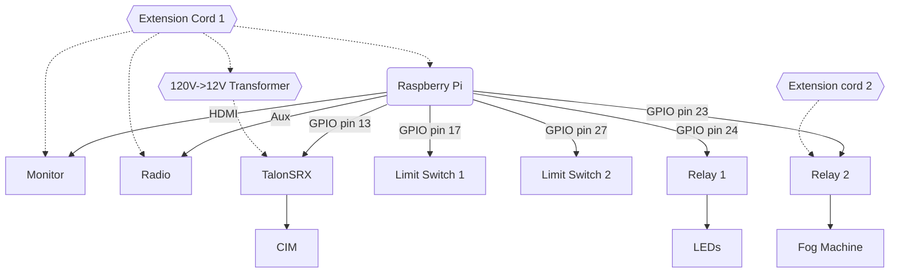

# floats-2022
All the code for the 2022 Senior float. 

This year's electrical components include the opening and closing hatch, the fog machine, the radio, the monitor, and the 
LED lights. Mechanically, these systems are connected like so:

### Radio
The radio module uses a similar architecture to the script from last year ([`hoco-radio-2021`](https://github.com/ky28059/hoco-radio-2021));
music files are read from `./music` and played in a tick-based while loop. 

`schedule.json` is a modified WATT schedule JSON with 0th and 8th periods removed to keep the school start and end times 
at their expected values; because of WATT's updated array-based syntax, these schedules are easier to parse than those 
used on the 2021 float. The script no longer checks the `MM-DD` formatted date, instead using the current weekday to load 
the schedule. Like last year, the script begins playing music 45 minutes before school, sets volume to 10% during class 
time, and stops playing music 15 minutes after school.

This year's music playlist can be found here: https://www.youtube.com/playlist?list=PL7WwPfnTGk9HsZMm-G_JlF1buJ8Nit32S
